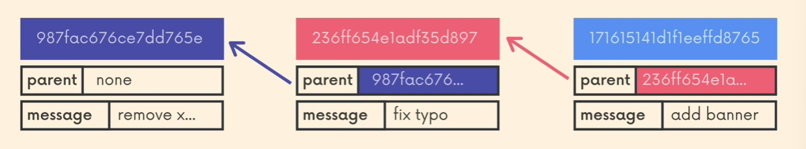
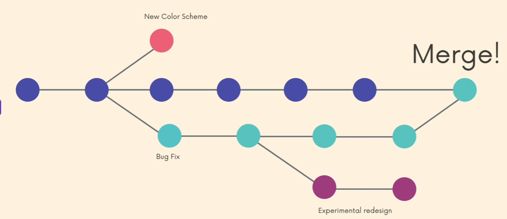
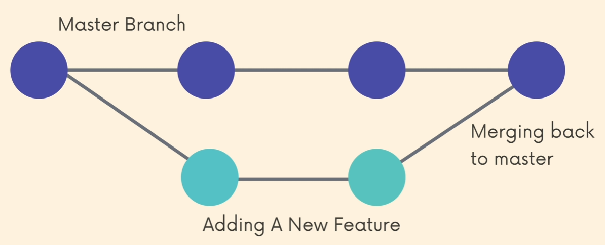

## Introducing Branches
- These are absolutely critical to git and using GitHub. 
- This is pretty much how it works in a linear fashion:
    - 
    - Each commit has a unique hash and references at least one parent commit that came before it. 
        - These are the steps that a program is coded.
- On large projects, there might be several people doing several different things at the same time. 
    - If they all worked in a linear fashion, it would take forever, and things you do might break other people's code. 
    - Everything has implications on other parts of the project and has to happen in a different context. 
- <b>Branches</b> - These are an essential part of Git. They can be thought of as alternate timelines for a project where we create separate contexts where we can try new things or even work on multiple ideas in parallel. 
    - Changes in one branch do not impact other branches, they live in isolation. (Unless we merge the changes.)
- Example of how this could look:
    - 
    - New color scheme branch is isolated and its version of the code does not exist in the bug fix and any of the subsequent branches. 
    - Bug fix merged with main code base. 

## The Master Branch (or is it Main?)
- We are always on a branch. 
- <b>Master Branch</b> - The default branch of any Git repository. It doesn't do anything special or have fancy powers. It's just the first one that you start on. 
- Some people designate the master branch as their "source of truth" or the "official branch" for their codebase, but that is left to the developer to decide. 
- From Git's perspective, the master branch is just like any other branch. it does not have to hold the "master copy" of your project. 
- In 2020, GitHub renamed the default branch from master to main. The default Git branch is still master, though the Git team is exploring a potential change. 
    - We'll circle back to this shortly. 
- This is a common workflow called feature branching
    - 
- Basically a branch is made off of main, then it is decided that it should be merged into the "source of working truth". 

